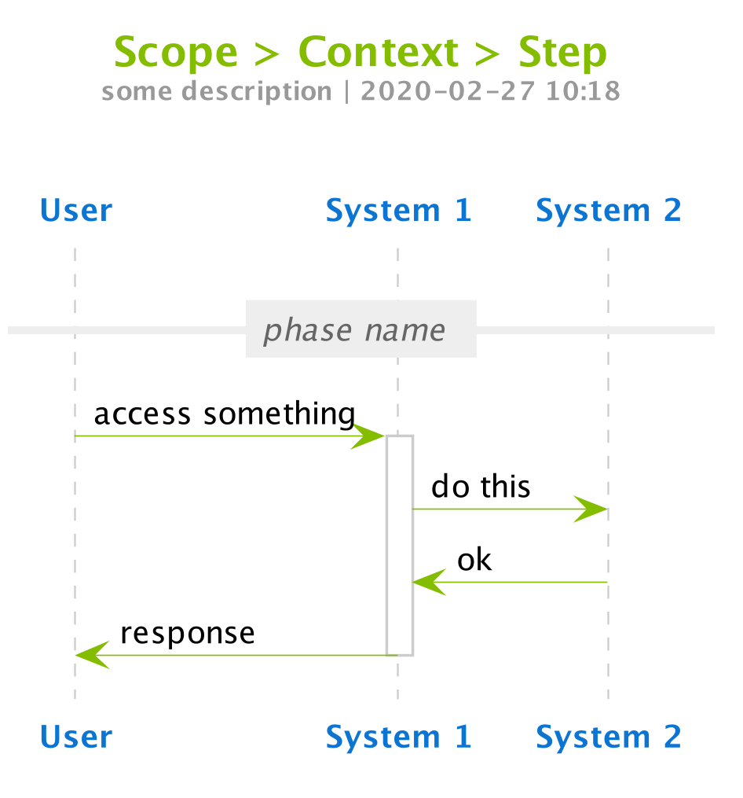

# PlantUML Assets

This repository contains the design assets that we - Connectis - are using in PlantUML based diagrams.

## Quick Example

Whenever we do a PlantUML diagram, we refer to this publicly exposed `connectis-skinparams.iuml` like this:
```plantuml
@startuml

scale 900 width

skinparam dpi 300
skinparam width 1000

!include https://github.com/Connected-Information-systems/plantuml-assets/raw/master/connectis-skinparams.iuml

title
        Scope > Context > Step
        <font size="10" color=#999999>some description | 2020-02-27 10:18</font>

end title

participant "<b>User</b>" as usr
participant "<b>System 1</b>" as sys1
participant "<b>System 2</b>" as sys2

== phase name ==

usr -> sys1: access something
activate sys1
sys1 -> sys2: do this
sys2 -> sys1: ok
sys1 -> usr: response
deactivate sys1

@enduml
```

And the result is:


